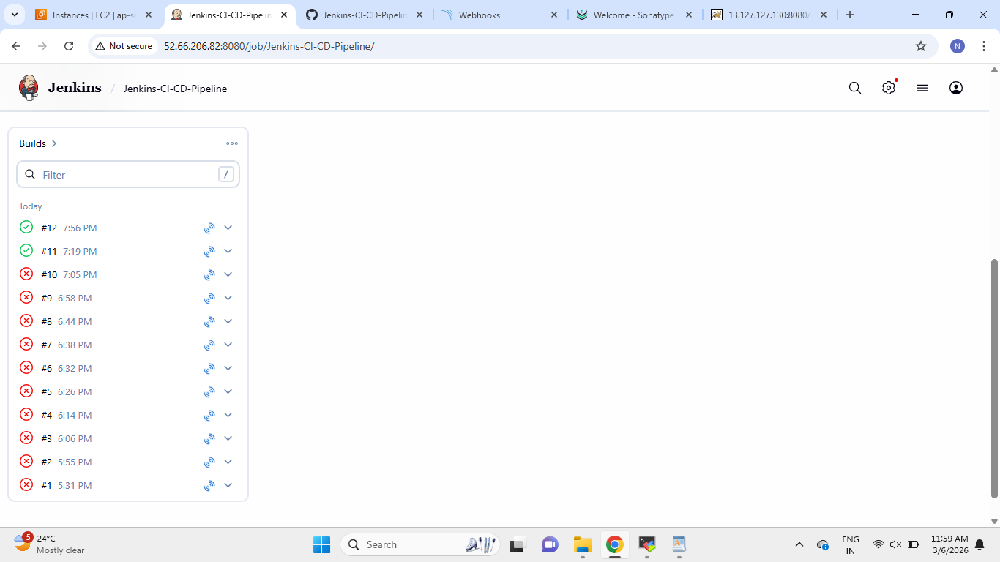
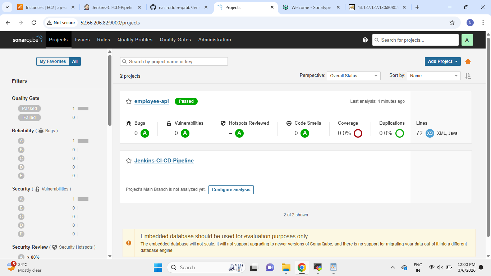
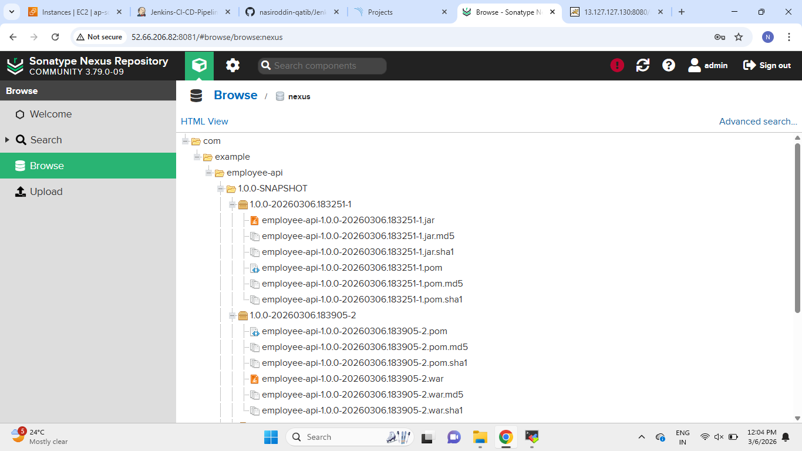
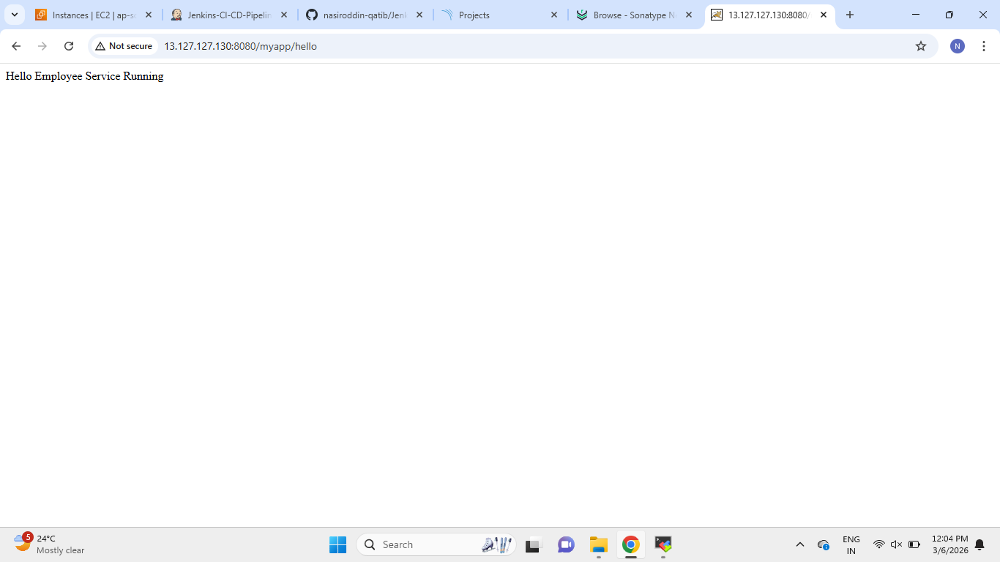
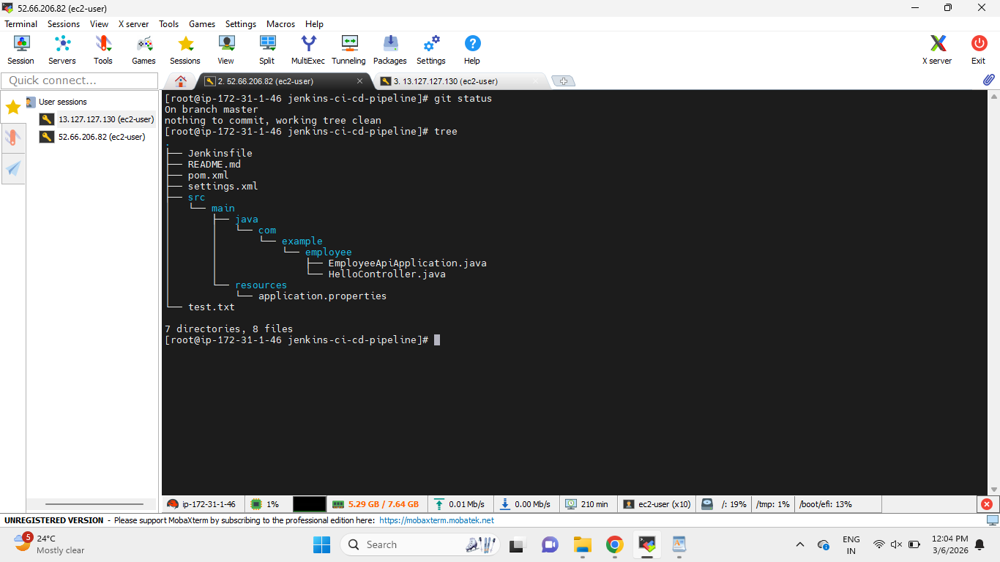

# 🚀 Jenkins CI/CD Pipeline with SonarQube, Nexus and Tomcat Deployment

---

## 📌 Project Overview

This project demonstrates a **complete CI/CD pipeline** using **GitHub, Jenkins, Maven, SonarQube, Nexus Repository, and Apache Tomcat**.

The application used in this pipeline is a **Spring Boot Employee API built with Maven**.

Whenever a developer pushes code to the GitHub repository, a **GitHub Webhook automatically triggers the Jenkins pipeline**.

The pipeline performs the following tasks:

• Jenkins automatically pulls the latest source code from GitHub
• Maven builds the application and runs automated tests
• SonarQube performs static code analysis
• Quality Gate verifies code quality
• Maven packages the application
• Artifact is uploaded to Nexus Repository
• Application is deployed to an Apache Tomcat server

This architecture simulates a **real-world CI/CD pipeline used in DevOps environments**.

---

## 🧭 CI/CD Pipeline Architecture

The following diagram represents the CI/CD pipeline implemented in this project.

```
Developer Push Code
        │
        ▼
GitHub Repository
        │
        ▼
GitHub Webhook Trigger
        │
        ▼
Jenkins Pipeline
        │
        ├── Checkout Code
        ├── Build (Maven)
        ├── Run Tests
        ├── SonarQube Code Analysis
        │
        ▼
Quality Gate Check
        │
        ├── ❌ Failed → Pipeline Stops
        │
        └── ✅ Passed → Continue Pipeline
                        │
                        ▼
                 Package Artifact (JAR)
                        │
                        ▼
              Upload Artifact to Nexus
                        │
                        ▼
            Deploy Application to Tomcat
```

---

## ⚙️ Tech Stack

• Java 17
• Spring Boot
• Maven
• Jenkins
• SonarQube
• Nexus Repository Manager
• Apache Tomcat
• Git
• GitHub
• GitHub Webhooks

---

## 📂 Project Structure

```
Jenkins-CI-CD-Pipeline
│
├── Jenkinsfile
├── pom.xml
├── settings.xml
├── README.md
│
└── src
     └── main
          ├── java/com/example/employee
          │     ├── EmployeeApiApplication.java
          │     └── HelloController.java
          │
          └── resources
                └── application.properties
```

---

## ⚙️ Jenkins Pipeline Stages

### 1️⃣ Checkout

Jenkins pulls the latest source code from the GitHub repository.

---

### 2️⃣ Build

```
mvn compile
```

Maven compiles the application source code.

---

### 3️⃣ Test

```
mvn test
```

Runs automated unit tests to verify application functionality.

---

### 4️⃣ SonarQube Code Analysis

```
mvn sonar:sonar
```

SonarQube analyzes the source code and detects:

• Bugs
• Vulnerabilities
• Code Smells
• Security issues

---

### 5️⃣ Quality Gate Validation

After analysis, SonarQube sends the result to Jenkins using a **SonarQube Webhook**.

Jenkins waits for the Quality Gate result.

• If the Quality Gate **fails**, the pipeline stops
• If the Quality Gate **passes**, the pipeline continues

---

### 6️⃣ Package Application

```
mvn package
```

This command generates the final application artifact:

```
target/employee-api.jar
```

---

### 7️⃣ Upload Artifact to Nexus Repository

The pipeline uploads the generated artifact to **Nexus Repository Manager**.

```
mvn deploy
```

The artifact is stored and versioned in Nexus so it can be used later for deployments.

---

### 8️⃣ Deploy Application to Tomcat

After the artifact is stored in Nexus, the application is deployed to the **Apache Tomcat server**.

Example URL after deployment:

```
http://SERVER-IP:8080/myapp/hello
```

---

## 📸 Project Screenshots

### Jenkins Build History



---

### SonarQube Code Quality Check



---

### Nexus Artifact Repository



---

### Application Deployment Success



---

### Project Structure



---

## 🎯 What This Project Demonstrates

This project demonstrates hands-on experience with:

• Jenkins CI/CD pipeline creation
• GitHub Webhook automation
• Maven build lifecycle
• SonarQube code quality analysis
• Quality Gate validation
• Artifact storage using Nexus Repository
• Automated deployment to Tomcat server

---

## 👨‍💻 Author

Developed as part of hands-on practice to strengthen **AWS, DevOps, CI/CD pipelines, artifact management, and automation skills**.
